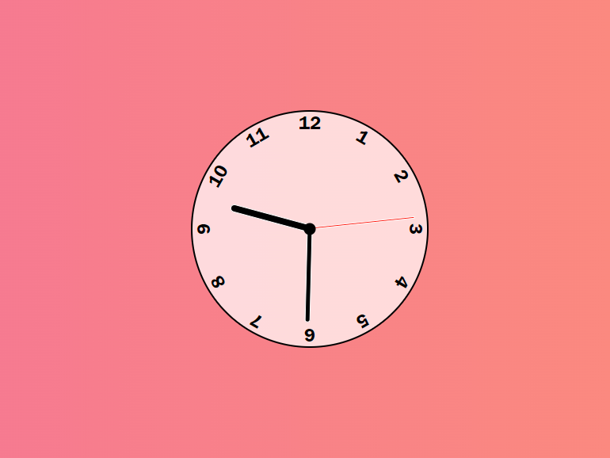

# Simple Clock

This is a very simple clock that mainly focuses on how javascript can be used to controll css properties. 
## Tech Stack

**Client:** HTML, CSS, JavaScript

**Server:** Live-Server

## Screenshots

